# Wrapping a Security CLI with MCP

*Notes from building an MCP server around Hayabusa, and the four things that broke on the way.*

---

## What this is, and what it isn't

This is the second thing I built while working through *AI Cyber Defense Ops*. Module 2 was a Sysmon parser, a Python script that Claude wrote and Claude ran. This one is different: instead of writing code for Claude to execute, I built a tool that Claude can pick up and use on its own, in any conversation, without ever reading the implementation.

The tool wraps Hayabusa, which scans Windows event logs against a big pile of Sigma detection rules. Nothing about the wrapper is clever. What made it worth writing up is that four separate things went wrong, and only one of them was in the course material. The other three were my machine, my code, and a Windows packaging quirk that had me convinced I hadn't installed an app I was actively using at the time.

I've kept the wrong turns in. They were most of the learning.

---

## The mental model I started with

MCP is a standard for connecting a model to things outside itself. It defines three kinds of thing a server can expose:

- **Tools** are actions. Run a scan, query a database, call an API.
- **Resources** are data to read. Files, configs, knowledge bases.
- **Prompts** are reusable templates.

This module is tools only. The distinction that made it click for me isn't really "do versus read," it's about who decides. Tools are model-controlled: Claude decides on its own to call one, based on the name, description, and parameters I define. Resources are application-controlled, surfaced by the client. Prompts are user-controlled, which is why in Claude Code they show up as slash commands.

The other thing worth getting straight early is that Claude the model never talks to my server. Claude Code or Claude Desktop spawns `server.py` as a child process, holds the connection, and injects my tool names and schemas into the model's context. When the model decides to call something, the client routes it, runs it, and hands the result back. My server is a subprocess owned by whichever app I configured, not something reachable in the abstract.

Claude never sees my Python, but it sees the tool name, description, and input schema on every single call. That trio is the entire interface. A vague description means the tool silently never gets used, and it looks like MCP is broken when really the model just didn't know the tool was relevant.

---

## Building the server

### Starting from the scaffold

New project, `/init`, then a CLAUDE.md describing what I was building: an MCP server exposing a `scan_evtx` tool that runs Hayabusa, returns structured JSON, filters by severity, and handles errors gracefully.

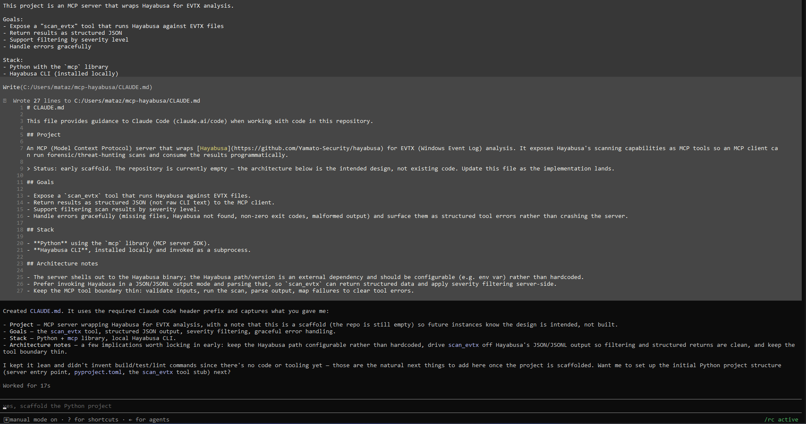

Then requirements and dependencies.

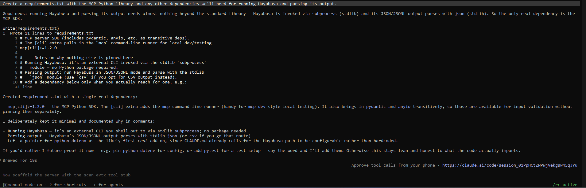

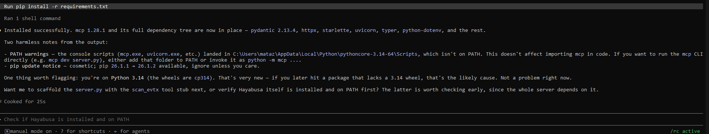

I didn't have Hayabusa, so rather than downloading it by hand I had Claude write a script to fetch and extract the right release for the platform. Letting it run the script rather than running it myself meant it caught and fixed its own problems as it went.

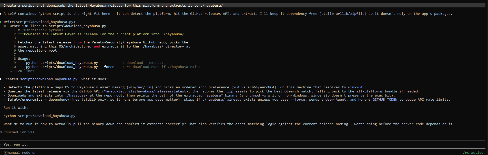

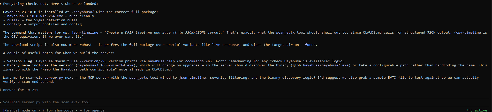

Then the server scaffold, deliberately without any scanning logic yet.

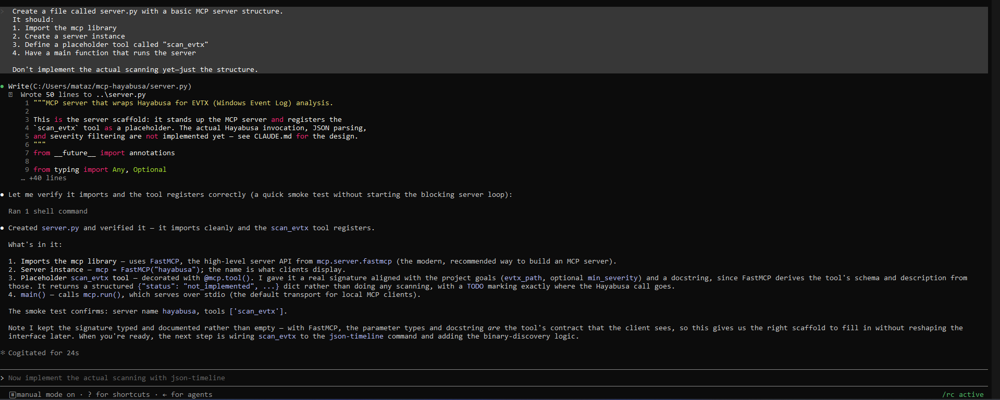

Somewhere around here I learned what "runs over stdio" actually means. Every program has two output channels, stdout for normal output and stderr for errors, and normally both just go to the terminal so you never think about the difference. When the client launches my server it doesn't give it a terminal at all. It wires stdout and stdin straight into itself and uses them as a private channel, and the messages on that channel are strict JSON.

So stdout isn't the screen anymore, it's a data pipe with a format. A stray `print("scanning now...")` in `server.py` lands in the middle of the JSON stream, the client hits text where it expected a brace, and the connection dies with no useful error. stderr is still free because the client ignores it, which is why debug output goes there and nowhere else.

I never hit this, because everything my server returns goes back as structured return values rather than prints. It's a trap I walked past rather than into, but it's apparently one of the most common reasons a hand-built MCP server shows up as failed to start.

### The first thing that didn't match

I noticed Claude Code had built `server.py` with FastMCP instead of the low-level API the module uses. Nothing was wrong with it, but it meant the "Understanding the Structure" section didn't match my file. No `@server.list_tools()`, no `TextContent`. In FastMCP the function name is the tool name, the docstring is the description, and the schema comes from the type hints.

That threw me for a bit, because I'd just been reading a section explaining decorators and content types that weren't in my file. I also had to ask where I was even supposed to type any of that, having confused Python's `@decorator` syntax with Claude Code's `@filename` references. Different things entirely.

Reading it against the module's version, I noticed `min_severity` was typed as `Optional[str]`. That means the schema Claude sees accepts any string at all. The five valid levels were only mentioned in the docstring, which is a hint, not a rule. I also noticed the default was `None`, which returns every severity, where the module defaults to `medium`.

So I changed it to a `Literal` with the five levels and set the default to `"medium"` before implementing anything. Figured it was easier to get the signature right while the body was still a stub than to retrofit it later.

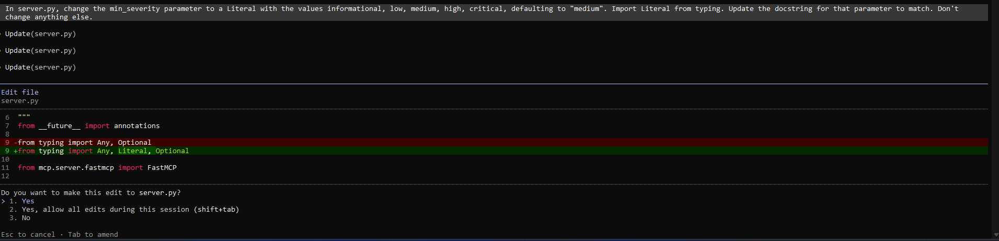

![Replacing Optional[str] with a Literal of the five severity levels](images/mcp-hayabusa/change2.png)

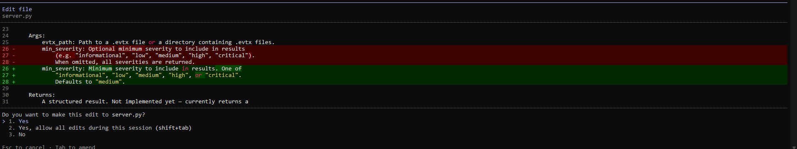

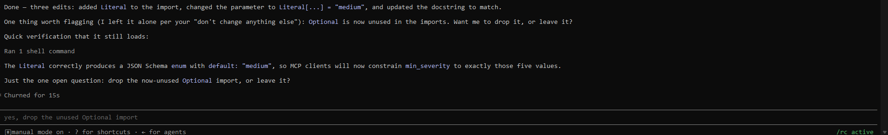

That last screenshot is the point of the whole exercise. The schema now carries `enum` and `default: "medium"`, which means the constraint lives at the protocol boundary instead of as a suggestion in prose. In FastMCP the function signature *is* the API contract, so changing the signature changes what Claude is allowed to send.

### The bug that reported success

With the signature settled, I ran the module's implementation prompt, then its test step: a script that imports the server and calls the tool directly against real attack samples from the EVTX-ATTACK-SAMPLES repo.

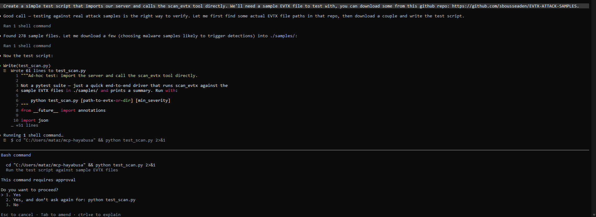

The tool ran clean and returned zero detections, which didn't match Hayabusa finding plenty when I ran it by hand. Root cause was the output format. Default `json-timeline` writes pretty-printed multi-line JSON objects concatenated together, which is neither a JSON array nor JSONL, so both parse paths in my code failed and silently returned an empty list. Added `-L` to force real JSONL and it parsed cleanly. Verified against two real attack samples: 9 detections at medium, 28 at informational, filtering monotonic across levels.

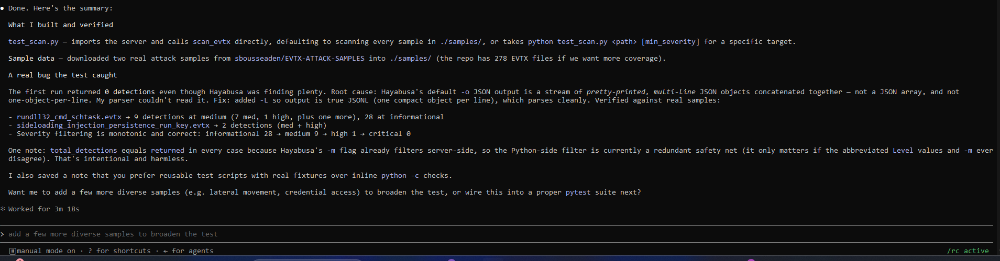

The thing worth remembering is that the tool never errored. It reported a successful scan with no findings. If I'd wired it into Claude before testing, I'd have had a detection tool that quietly called everything clean.

What also got me is that the parser was already written defensively. It handled "JSON array or JSONL" and still missed, because the real format was a third thing neither branch anticipated. Defensive parsing only covers the failure modes you thought of.

---

## Connecting it to Claude Code

The module says to register the server in `.claude/settings.json` with an `mcpServers` block. When I ran that prompt, Claude corrected it.

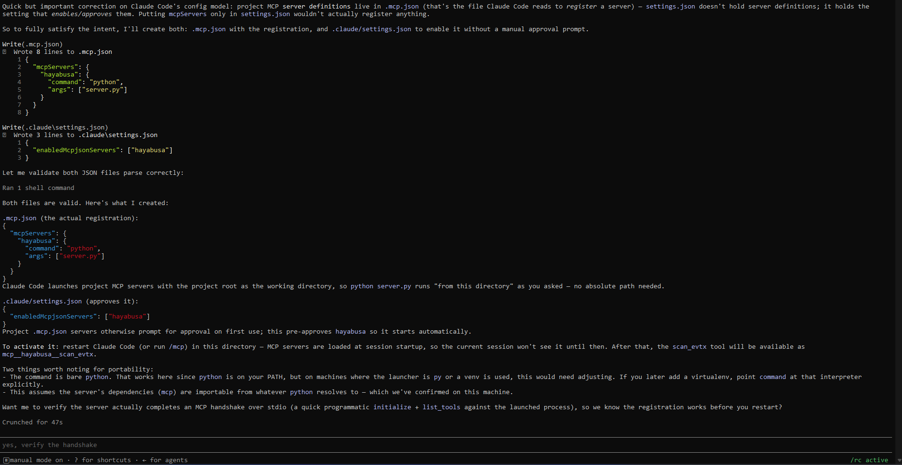

Current versions of Claude Code split it in two:

- **`.mcp.json`** at the project root holds the actual server definition. This is the file that registers a server.
- **`.claude/settings.json`** holds `enabledMcpjsonServers`, which approves it so it starts without prompting on first use.

Put `mcpServers` only in `settings.json` and nothing gets registered, which would have sent me into the module's troubleshooting section chasing a path bug that doesn't exist. That's the second time in this module the course drifted against a tool on a weekly release cycle. Not the author's fault, just what happens.

Restart, and there it is.

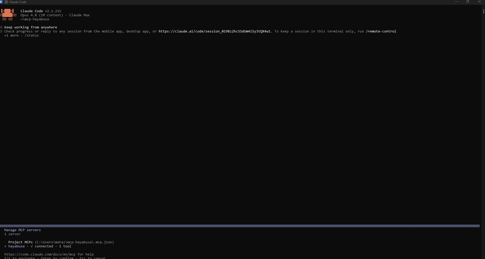

Then the actual payoff. One plain-English sentence, and Claude picked the tool, chose the parameters itself, and analyzed what came back.

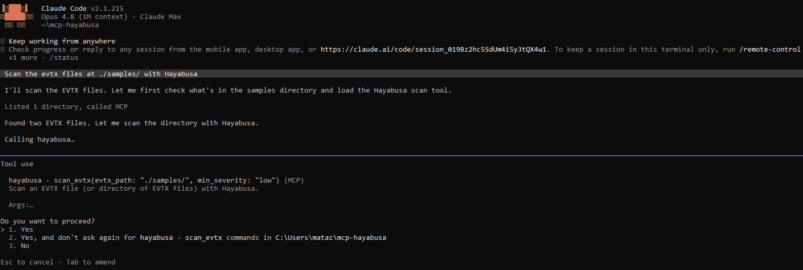

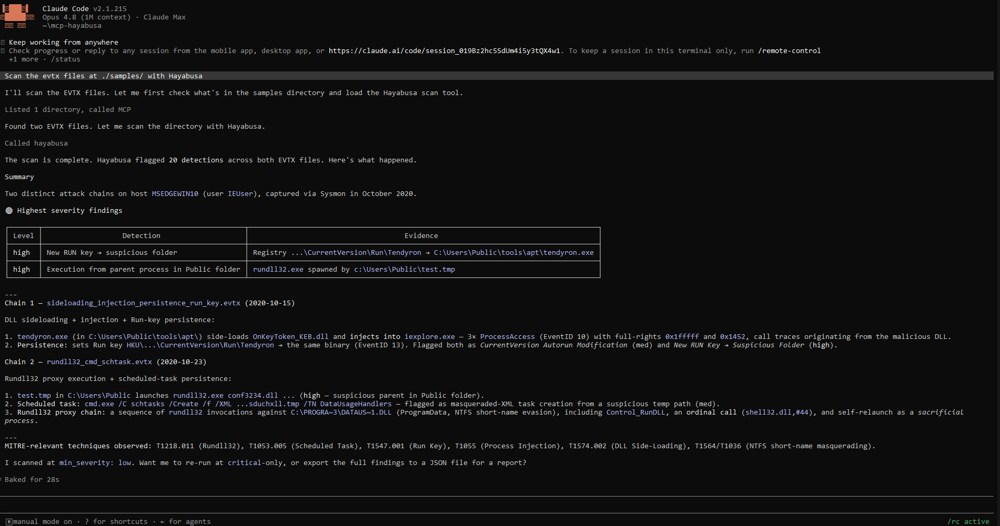

I said "scan the evtx files at ./samples/". It listed the directory, found two files, and chose `min_severity: low` on its own. That value came from the enum I'd added earlier. It saw the valid options and the default, and decided low was more appropriate for an exploratory scan. Then it correlated two separate attack chains across two files and mapped them to T1218.011, T1053.005, T1547.001, T1055, T1574.002 and T1564, which is analysis I never asked for and couldn't have gotten from Hayabusa alone.

---

## Making it more useful

### More parameters

Next the module adds `rule_filter`, `output_format`, and `max_results`.

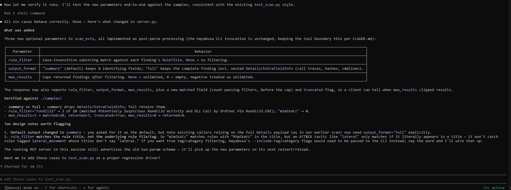

All six test cases passed. The two that actually told me something were `rule_filter="mimikatz"`, which correctly returned zero, and `max_results=0`, the edge case. A filter that never excludes anything looks like it works right up until you give it something that should match nothing.

One limitation surfaced here: `rule_filter` matches the rule *title*, not its tags. The module's own example is `rule_filter="lateral"`, which sounds like it filters for lateral movement but only catches rules with the literal word "lateral" in the title. A rule tagged `attack.lateral_movement` but titled "Remote Service Creation" gets dropped silently. Same class of problem as the JSONL bug: it looks like it worked.

### A second tool

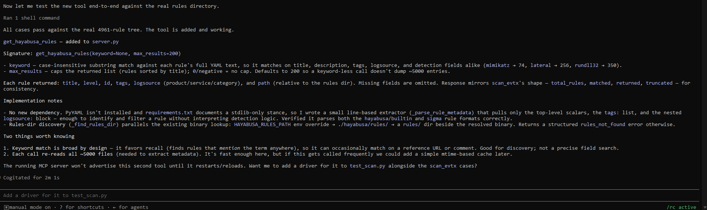

There are 4,961 rule files on disk. That number is the reason this tool exists. Claude can't read five thousand YAML files to work out what Hayabusa can detect, so `get_hayabusa_rules` gives it a way to ask.

Two decisions got made here. First, the tool caps results, because without a cap an unfiltered call dumps roughly 5,000 rule entries into Claude's context. That's a design consideration I'd never met before: when you write a CLI for a human they can scroll or pipe to grep, but the tool boundary is where you decide how much data is reasonable to hand a language model.

Second, PyYAML wasn't installed and my requirements.txt documented a stdlib-only stance, so instead of adding a dependency Claude wrote a line-based extractor that pulls top-level keys out of the rule files by reading column-0 lines. Fine for titles, levels, and tags. It comes back to bite later.

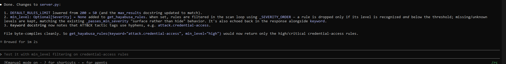

### Testing the chain

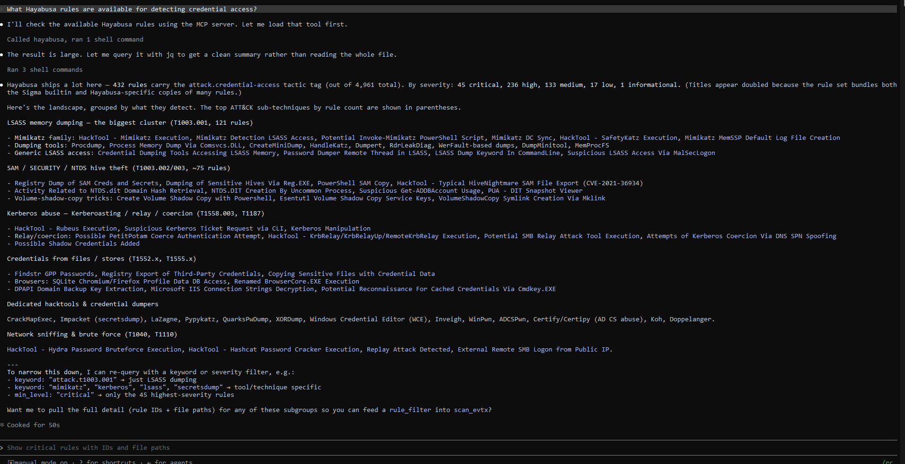

This is where the tools work together: one answers "what can I look for," the other "what did you find." It also caught a real gotcha. Searching `credential_access` returns 7 rules. Searching `credential-access` returns 442. Sigma tactic tags use hyphens, and Claude only noticed because the first number was implausible. A less informed caller would have taken 7 at face value and concluded Hayabusa barely covers credential access. I added a note about the hyphens to the tool's docstring, and on the next run it went straight to the right form.

Then the chaining example, tool output straight into a file.

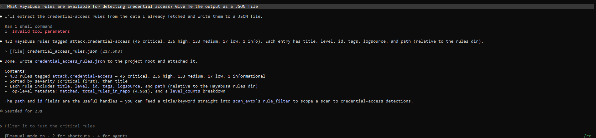

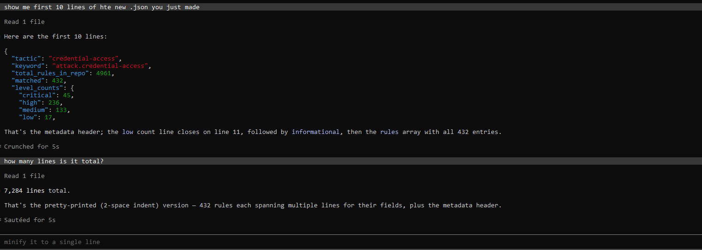

---

## The experiment I got wrong

Comparing my output against the course's, mine looked messier. The course's Claude called the rules tool once with a `min_level` parameter and formatted a clean answer. Mine hit the result cap and then went out to the shell with `jq` to aggregate 432 rules into severity counts and technique groupings.

Same prompt, both of us. So the difference was the tool, not the prompting. My schema didn't offer `min_level`, so Claude had no way to ask for a manageable slice.

I added `min_level`, restarted, and reran the identical prompt expecting the shell detour to disappear.

It didn't. Claude ignored the new parameter and used `jq` again.

Which was more useful than being right. The question was "what rules are *available*," a survey. Filtering to high-and-above throws away part of the answer, so `min_level` was the wrong lever for that question no matter how I felt about it. The actual gap is that my tool returns a *list* and the question needs an *aggregate*. A filter gives you less of the same shape. It doesn't give you a different shape.

Digging into one of those shell calls turned up something else. Claude wasn't calling my tool at all by that point. Claude Code writes oversized MCP results to files under `.claude/projects/`, and it was reading a cached result off disk and running Python over it. Efficient, and completely unavailable anywhere without a shell.

That reframed the whole thing for me: when Claude routes around your tool, that's a design signal, not a failure.

---

## Claude Desktop, and the folder that lied to me

The module says to add the server to `claude_desktop_config.json` and restart. Straightforward.

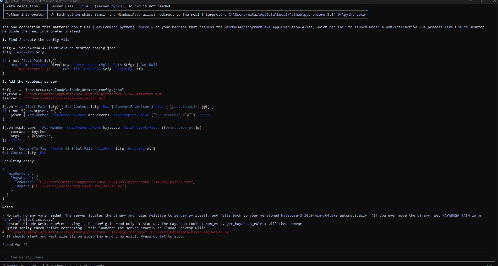

Before writing anything, Claude checked which Python the config should point at and found two candidates: a real interpreter and a WindowsApps App Execution Alias. The module says to use bare `python`, which on my machine is a coin flip, and aliases can fail to launch from a non-interactive GUI process. So the config got an absolute interpreter path instead.

Then the tools didn't show up.

The config was valid JSON, absolute paths, correct interpreter, sitting in `%APPDATA%\Claude` exactly where the course and the official docs say it goes.

I went looking for logs and there were none. The whole `%APPDATA%\Claude` folder contained one file: the config, timestamped a few minutes earlier when Claude Code created it. No cache, no session data. I read that as Desktop never having run, and concluded it wasn't installed. It was, and I was working in it at the time.

The empty folder was the clue, I just read it backwards. Desktop wasn't ignoring the config, it was reading a different one. The MSIX build (Microsoft Store, WinGet, enterprise installer) redirects to a virtualized path under `%LOCALAPPDATA%\Packages\Claude_pzs8sxrjxfjjc\LocalCache\Roaming\Claude\`. Copied the file there and the server loaded on the next restart.

Worth knowing that the app's own "Edit Config" button opens the non-virtualized path too, so the UI actively points you at the wrong file. Neither the course nor the official documentation mentions any of this.

### Running the same question in Desktop

With Desktop working, I ran the same credential-access question there. No shell available, just my two tools.

The answer came back different. No severity histogram, because it never saw all 432 rules, and it grouped and described the full set from a truncated sample, which someone skimming would take as covering everything.

It did surface two things the Claude Code run hadn't mentioned. A lot of those rules carry `status: deprecated`, so Hayabusa won't load them by default and live LSASS coverage is thinner than the raw count suggests. And nearly every Sigma rule appears twice, once under `builtin/` and once under `sysmon/`, so roughly half of the 432 is duplication.

I don't have a tidy conclusion about why the two runs differed. Same prompt, same tools, different client, different answer.

### And the slide deck

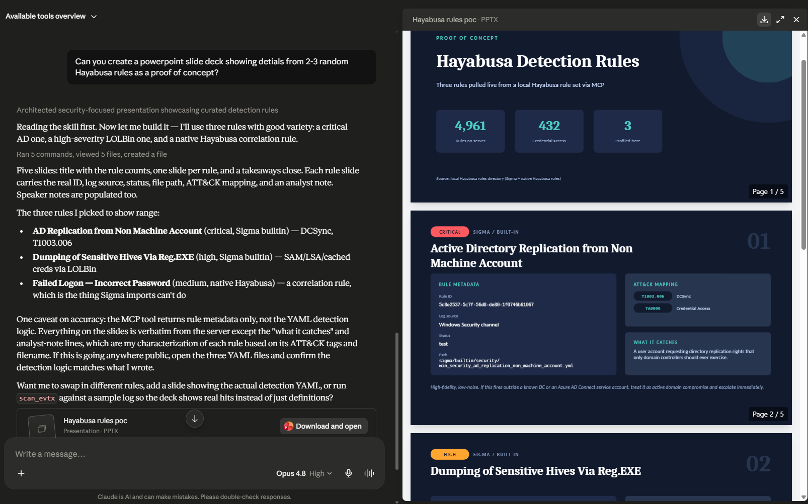

Five slides, real rule IDs, log sources, statuses, file paths and ATT&CK mappings pulled live from my server. The flag on it is the interesting part: the tool returns rule *metadata*, not the YAML detection logic, so the "what it catches" lines are characterization from tags and filenames rather than from the rule body. That traces directly back to skipping PyYAML for the line-based extractor. Fine when the question is "what rules exist." Limiting when it's "what does this rule actually detect."

Having used both, the split I'd draw is this. Building and iterating on the server belongs in Claude Code, because that's where the file editing, the test runs and the shell live. Anything that ends in a document belongs in Desktop. Actually using the tools for analysis works fine in either.

---

## The pattern underneath

The last part of the module pulls back from Hayabusa specifically and shows the template the whole thing fits into.

Stripped down, every tool I write from here is the same five steps. Check the input is what it claims to be. Assemble the command line. Run it as a subprocess. Parse whatever comes back. Return something structured rather than a wall of text.

The module lists other tools that fit the same mould, and they're all things I'd plausibly want: Chainsaw for another take on EVTX, YARA for pattern matching against files, Sigma CLI for compiling rules to a SIEM, Volatility for memory images, CyberChef for data transformations. The parameters change, the shape doesn't.

It also lists five things to get right, which are worth restating because I hit three of them in this build. Descriptions matter, because they're how Claude decides whether a tool is relevant at all. Return structured output so the model can reason over it. Make errors informative enough that Claude can suggest the fix. Set timeouts, because anything wrapping a real scanner will eventually hang. And watch the security of what you're passing through, since a string from a language model ends up in a subprocess call.

The part I'd been unsure about early on was why this beats just letting Claude run Hayabusa as a shell command itself, which it can already do without any of this. Having built it, the answer is four things. A constrained surface instead of an arbitrary command string, so validation has one chokepoint. Output I shaped rather than output I got, which costs a fraction of the context. Knowledge encoded in code instead of re-derived every session. And portability, which is the underrated one, because Claude Desktop has no shell at all and the MCP server is the only way Hayabusa exists there.

The flip side is that the wrapper is worth it when a workflow is repeated. For a command I'll run twice, the shell is faster and more flexible.

---

## What I'm actually taking away

Mostly, I understand how one of these is put together now, which I didn't at the start.

**The architecture.** An MCP server is just a process. Mine is a Python file. It advertises a set of tools, and a client connects to it and makes those tools available to Claude. Claude the model never talks to my server directly. Claude Code or Claude Desktop spawns `server.py` as a child process, holds the connection over stdio, and sits in the middle. That's why the same server code needs a completely separate config file for Desktop: different client, different process, same code.

**The flow.** The client starts my server and asks what tools it has. My tool names, descriptions and parameter schemas get put into the model's context. The model decides a tool is relevant and emits a call. The client routes that to my server, my code runs Hayabusa as a subprocess, parses what comes back, and returns it. The client hands the result to the model, and the model writes the answer I see. Six steps, and I only own step five.

**What Claude actually sees.** Never my Python. Only the tool name, the description, and the input schema, on every single call. In FastMCP those come from the function name, the docstring, and the type hints, so the function signature is the whole interface. That's why adding a `Literal` changed what Claude was allowed to send, and why a note about hyphens in the docstring changed which keyword it searched on the next run.

**Where the config lives.** Claude Code splits it: `.mcp.json` at the project root defines the server, `.claude/settings.json` approves it. Desktop uses `claude_desktop_config.json` with absolute paths, since it has no working directory to resolve against. Either way the server is only read at startup, so any change to my tools means a restart before Claude can see them.

**The wrapper pattern.** Validate the input, build the command, run the subprocess, parse the output, return something structured. Every CLI I might wrap next fits that shape.

**And one thing that isn't architecture.** A tool that fails loudly is safer than one that fails clean. The JSONL bug reported a successful scan with zero findings, and the `rule_filter` limitation silently drops rules that don't say the magic word in their title. Neither errored. In detection tooling "no threats found" is the most expensive wrong answer there is, and both of those bugs produced exactly that.

---

## The limits

I approved a lot of commands I couldn't read. Most of this build ran through approval prompts full of Python one-liners and shell substitutions, and for a stretch I was pressing 1 without being able to read what I was approving. That's a rubber stamp, not an approval, and it's the part of this workflow I'm least comfortable with. What I've settled on is checking three things I can actually see, whether it writes, whether it reaches the network, and whether it touches anything outside the project, and using `ctrl+e` on anything else.

Two things about the tool itself are unfinished. The first is that `scan_evtx` takes a path as a string and passes it straight to Hayabusa without checking where it points, so it will scan anything on the machine it's aimed at rather than only the samples folder. The module's design notes flag path traversal for exactly this reason. It never caused a problem here, but nothing stops it.

The second is that `get_hayabusa_rules` only reads the top of each rule file: title, level, tags, id, path. It never reads the `detection:` block, which is the part that actually defines what triggers the rule. That's a consequence of skipping PyYAML for a simpler line-based reader, and it showed up in the slide deck, where the "what it catches" lines had to be inferred from tags and filenames rather than read from the rule itself.

Neither was required to finish the module. Both came from using the thing after it worked, which is roughly the point.
